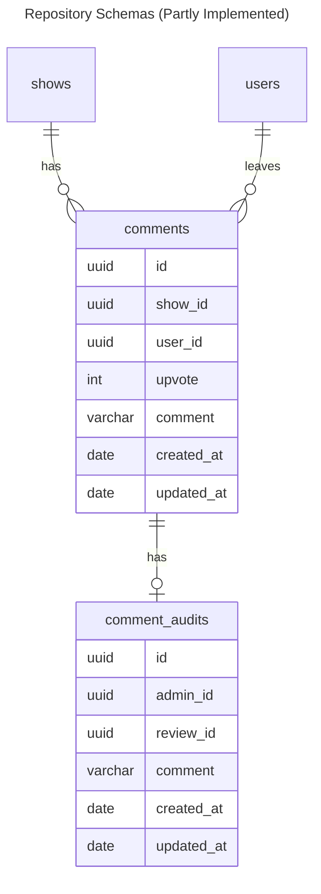

# Data Structure

## Intuitions

- Use UUID in IDs to mitigate implementation leak related vulneribilities and the possiblity of illegal access, compared to its sequential integer ID counterpart
- Audit-related fields of a comment are placed in another table `comment_audits` as they are optional to a comment
- Field `updated_at` is here for audit/tracing purposes

## Gotchas

- To ensure data integrity, foreign keys or transaction mechanisms (if they are available) should be set
- Date should be stored in UTC format and let repo consumers handle timezone-related logic instead

## Enhancements

- General
    - Enforce soft deletion with field `deleted_at` for future audit purposes

- comments
    - Add `hidden_at` field to hide comments
    - Field `comment` and `upvote` type could be further narrowed down to save space and API payload size, depending on the usage
